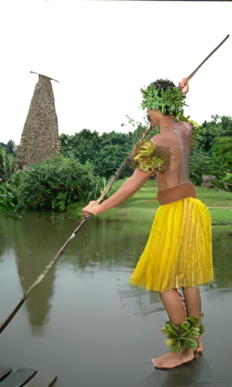
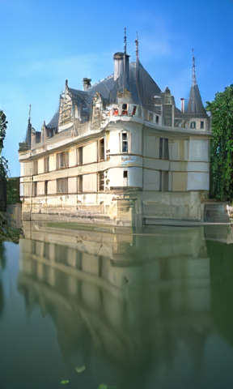
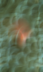
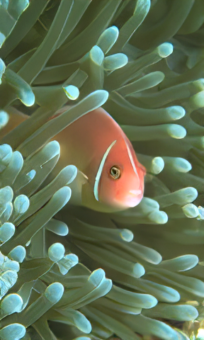
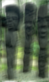
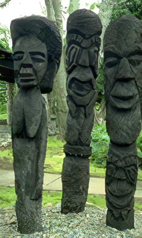
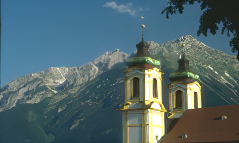
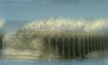
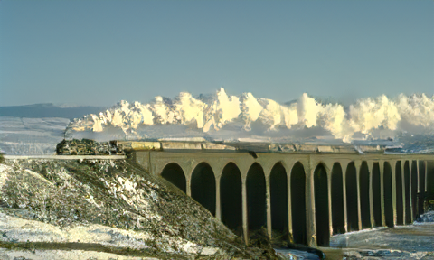
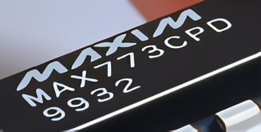

# DPSR

# Deep Plug-and-Play Super-Resolution for Arbitrary Blur Kernels (CVPR, 2019)


# Training and testing codes for the super-resolver prior ([PyTorch](https://github.com/cszn/KAIR))
- [main_train_dpsr.py](https://github.com/cszn/KAIR/blob/master/main_train_dpsr.py)

- [main_test_dpsr.py](https://github.com/cszn/KAIR/blob/master/main_test_dpsr.py)

***

The left is the blurry LR image. The right is the super-resolved image by DPSRGAN with scale factor 4.

Run [demo_test_dpsr.py](demo_test_dpsr.py) to produce the following results.


 
 

 
 

 

 

***

Super-resolved images of LR image [chip.png](testsets/real_imgs/LR/chip.png) by DPSR with scale factors 2, 3 and 4.

Run [demo_test_dpsr_real.py](demo_test_dpsr_real.py) to produce the following results.


  LR

  x2

  x3

  x4


# Requirements and Dependencies
- Spyder (Python 3.6)
- PyTorch 0.4.1
- Windows 10


# Citation
```
@inproceedings{zhang2019deep,
  title={Deep Plug-and-Play Super-Resolution for Arbitrary Blur Kernels},
  author={Zhang, Kai and Zuo, Wangmeng and Zhang, Lei},
  booktitle={IEEE Conference on Computer Vision and Pattern Recognition},
  pages={1671--1681},
  year={2019}
}
```
